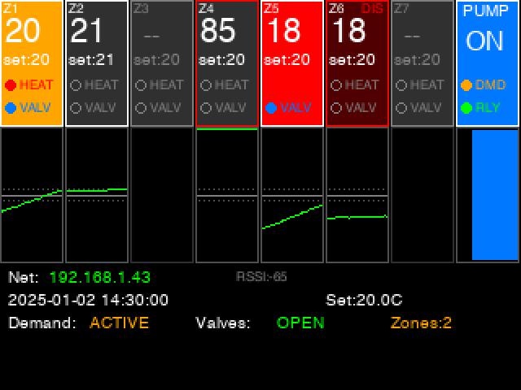
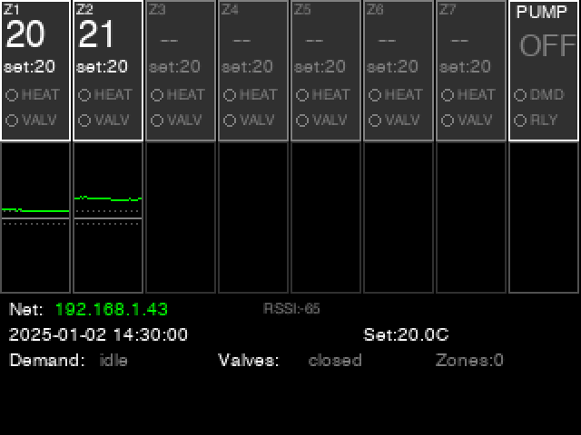
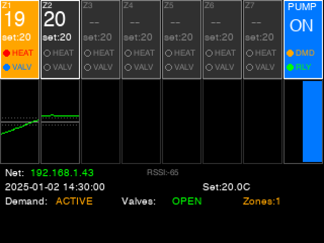
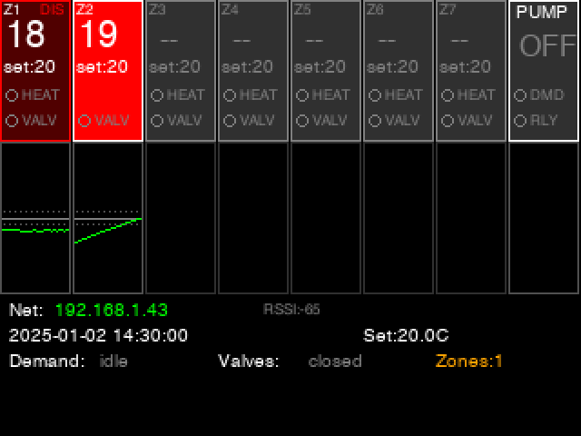

# Radiant Heat Controller

ESP32-S3 firmware for a 7-zone radiant floor heating controller using ESPHome. The system manages zone thermostats, temperature sensors, relay outputs, and a circulation pump with valve feedback interlocking.

## Hardware

**Development Board:** [Waveshare ESP32-S3-ETH-8DI-8RO](https://devices.esphome.io/devices/waveshare-esp32-s3-eth-8di-8do/)
- MCU: ESP32-S3-WROOM-1U-N16R8 (16MB flash, 8MB PSRAM)
- 8 digital inputs (DI1-DI8) with opto-isolation for valve feedback
- 8 relay outputs (DO1-DO8) via PCA9554 I2C expander
- WiFi connectivity (Ethernet available but unused)

**External Components:**
- Adafruit DS2484 I2C-to-1-Wire breakout for temperature sensors
- DS18B20 temperature sensors on 1-Wire bus (one per zone)
- WS2812 RGB status LED
- 2.2" ILI9341 TFT display (320x240)

## Prerequisites (macOS)

Install ESPHome via pipx:
```zsh
brew install pipx
pipx ensurepath
pipx install esphome
```

For display mockup generation:
```zsh
pip install Pillow
```

## Getting Started

1. **Create your secrets file:**
   ```zsh
   cp esphome/secrets.example.yaml esphome/secrets.yaml
   ```
   Edit `esphome/secrets.yaml` with your WiFi credentials and passwords.

2. **Compile firmware:**
   ```zsh
   esphome compile esphome/actuator.yaml
   ```

3. **First-time USB upload:**
   ```zsh
   esphome upload esphome/actuator.yaml --device /dev/tty.usbserial-XXXX
   ```

4. **Discover sensor addresses:** See [Sensor Discovery](#sensor-discovery) below to identify DS18B20 addresses for each zone.

5. **Update sensor addresses:** Edit `esphome/actuator.yaml` with the discovered addresses for each zone sensor, then recompile and upload.

6. **OTA uploads (after initial flash):**
   ```zsh
   esphome upload esphome/actuator.yaml
   ```

7. **Dashboard (local UI):**
   ```zsh
   esphome dashboard esphome
   ```

## Operation

### TFT Display

The 2.2" TFT display shows real-time status of all zones and the circulation pump:



**Zone Boxes (7 zones + pump):**
Each zone box shows:
- **Zone number** (Z1-Z7) in top left
- **Current temperature** (large text)
- **Setpoint** (set:XX)
- **HEAT indicator** - filled red circle when calling for heat
- **VALV indicator** - filled blue circle when valve is confirmed open
- **DIS indicator** - shown in red when zone is disabled by failsafe

**Background colors indicate status:**
- **Dark gray** - Idle/normal
- **Orange** - Actively heating
- **Red** - Safety error (error score >= 50)
- **Dark red** - Zone disabled by failsafe

**Gray outline** indicates sensor not connected for that zone.

**Temperature graphs** below each box show 20 minutes of history:
- Green line: actual temperature
- Gray center line: setpoint
- Dotted lines: hysteresis bounds

**Pump box** shows:
- ON/OFF status
- DMD (demand) - orange when any zone calls for heat
- RLY (relay) - green when pump relay is energized
- Binary graph showing pump run history

**Status bar** at bottom shows:
- Network status and IP address
- Current date/time
- Global setpoint
- Demand status, valve summary, active zone count

### Display States

**Idle Operation:**


**Active Heating:**


**Error Conditions:**


### Web Interface

The controller runs a web server on port 80 accessible at `http://<device-ip>/`. The web interface provides:

- Real-time sensor values for all zones
- Thermostat controls (mode, setpoint)
- Pump status and relay states
- Valve feedback status
- Error scores for each zone
- Memory diagnostics (heap, PSRAM)
- Configuration parameters (delays, hysteresis)
- Buttons for error reset and device restart

### Home Assistant Integration

The controller exposes the following entities via the ESPHome API:

**Climate Entities (per zone):**
- `climate.zone_X_thermostat` - Thermostat with heat mode, target temperature

**Sensors:**
- `sensor.zone_X_temperature` - Current temperature (°C)
- `sensor.zone_X_error_score` - Failsafe error score (0-100)
- `sensor.free_heap_memory` - Available internal RAM (KB)
- `sensor.free_psram` - Available PSRAM (KB)
- `sensor.uptime` - Time since last boot

**Binary Sensors:**
- `binary_sensor.zone_X_valve_open` - Valve feedback status
- `binary_sensor.zone_X_disabled` - Zone disabled by failsafe
- `binary_sensor.circulation_pump_running` - Pump relay state
- `binary_sensor.any_valve_open` - Any valve confirmed open

**Controls:**
- `number.global_setpoint` - Default setpoint for all zones
- `number.pump_start_delay` - Delay before starting pump (seconds)
- `number.pump_stop_delay` - Delay before stopping pump (seconds)
- `number.thermostat_hysteresis` - Temperature deadband (°C)
- `number.error_disable_delay` - Time at error score 100 before disabling (minutes)
- `button.reset_all_zone_errors` - Clear error scores and re-enable zones
- `button.restart_controller` - Reboot the controller
- `button.scan_1_wire_sensors` - Discover all sensors on the 1-Wire bus

**Diagnostics:**
- `sensor.discovered_sensor_count` - Number of sensors found on last scan
- `text_sensor.discovered_1_wire_sensors` - List of all discovered sensors with addresses and temperatures

## Sensor Discovery

The controller includes a built-in sensor discovery feature for identifying DS18B20 temperature sensor addresses on the 1-Wire bus.

### Using Sensor Discovery

1. **Trigger a scan:** Press the "Scan 1-Wire Sensors" button in Home Assistant or the web interface
2. **View results:** Check the "Discovered 1-Wire Sensors" text sensor, which displays:
   ```
   00: 0x28FF1234567890AB  21.5°C
   01: 0x28FF2345678901BC  19.8°C
   02: 0x28FF3456789012CD  22.1°C
   ...
   ```
3. **Identify sensors:** Heat individual sensors (hold in hand, apply warm air) and watch temperatures change to determine which address corresponds to which physical location
4. **Update configuration:** Copy the desired address and update `esphome/actuator.yaml`:
   ```yaml
   - platform: dallas_temp
     one_wire_id: onewire_bus
     address: 0x28FF1234567890AB  # Paste address here
     name: "Zone 1 Temperature"
   ```
5. **Deploy:** Recompile and upload the firmware

The discovery feature supports up to 30 sensors on a single 1-Wire bus.

## Safety Features

### Pump Interlocking

The circulation pump only runs when:
1. At least one zone is calling for heat (pump demand)
2. At least one valve is confirmed open (valve feedback)

This prevents the pump from running against closed valves and ensures water flow before energizing the pump.

Configurable delays prevent short-cycling:
- **Pump Start Delay** (default 5s): Wait after demand before starting
- **Pump Stop Delay** (default 30s): Continue running after demand ends

### Failsafe Monitoring

The controller continuously monitors for zone malfunctions:

**Valve Timeout Detection:**
- If a relay is commanded ON but valve feedback doesn't confirm within 10 minutes
- Indicates stuck valve, wiring issue, or feedback sensor failure

**Temperature Rise Monitoring:**
- After 5 minutes of active heating with valve confirmed open
- Expects at least 0.2°C temperature rise
- No rise indicates flow problem, sensor issue, or heat source failure

### Error Score System

Each zone maintains an error score (0-100):
- **+5 points** per failure detection (every 30 seconds while failing)
- **-1 point** decay when operating normally or idle
- **Score >= 50**: Safety warning (red background on display)
- **Score = 100 for 5+ minutes**: Zone automatically disabled

When disabled:
- Zone relay is forced OFF
- Display shows "DIS" indicator with dark red background
- `binary_sensor.zone_X_disabled` becomes true in Home Assistant

### Recovery

To re-enable disabled zones:
1. Fix the underlying issue (valve, wiring, sensor)
2. Press "Reset All Zone Errors" button in Home Assistant or web interface
3. Error scores reset to 0 and zones are re-enabled
4. Relays automatically re-engage for zones still calling for heat

### Setpoint Persistence

Per-zone setpoints are saved to flash and restored after power cycles. Changes made via Home Assistant or the web interface persist across reboots.

## Troubleshooting

### 85°C Temperature Reading

A reading of exactly 85°C indicates a DS18B20 sensor power-on reset. This typically means:
- Insufficient power to the sensor
- Intermittent 1-Wire bus connection
- Sensor addressed before completing conversion

The display shows a red outline for zones with this error.

### "Scratch pad checksum invalid" in Logs

Indicates 1-Wire bus communication issues. Check:
- Wiring connections
- Pull-up resistor (4.7kΩ recommended)
- Cable length (keep under 10m)
- Parasite power vs dedicated power

### Zone Not Heating

Check in order:
1. Is the thermostat calling for heat? (HEAT indicator on display)
2. Is the valve opening? (VALV indicator)
3. Is the error score high? (Check HA sensor)
4. Is the zone disabled? (DIS indicator)

### Pump Not Running

The pump requires both conditions:
1. At least one zone calling for heat
2. At least one valve confirmed open

Check the DMD and RLY indicators in the pump box.

## Development

### VS Code Tasks

Use Command Palette → "Run Task" for:
- Compile
- Upload (USB)
- Upload (OTA)
- Dashboard

### Scripts

Convenience wrappers in `scripts/`:
- `build.sh` – compile firmware
- `upload_usb.sh [serial]` – upload via USB
- `upload_ota.sh [host]` – OTA upload
- `dashboard.sh` – launch ESPHome dashboard
- `render_display.py` – generate display mockup images

### Regenerating Documentation Images

```zsh
python scripts/render_display.py docs/images
```

This recreates the TFT display mockups using the same rendering logic as the actual firmware.

## File Structure

```
├── esphome/
│   ├── actuator.yaml      # Main ESPHome configuration
│   ├── secrets.yaml       # WiFi/API credentials (git-ignored)
│   └── secrets.example.yaml
├── scripts/
│   ├── build.sh
│   ├── upload_usb.sh
│   ├── upload_ota.sh
│   ├── dashboard.sh
│   └── render_display.py  # Display mockup generator
├── docs/
│   └── images/            # Generated display mockups
├── CLAUDE.md              # AI assistant context
└── README.md              # This file
```

## Notes

- `esphome/secrets.yaml` is git-ignored - keep it safe
- Use the "Scan 1-Wire Sensors" button to discover sensor addresses (see [Sensor Discovery](#sensor-discovery))
- Temperature displayed in Celsius throughout
- Zone 8+ expansion available via commented XL9535 section
